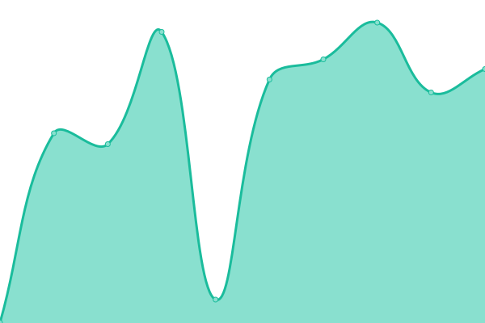

# [📈 Live Status](https://upptime.0il.pw): <!--live status--> **🟧 Partial outage**

This repository contains the open-source uptime monitor and status page for [lqvp](https://upptime.0il.pw), powered by [Upptime](https://github.com/upptime/upptime).

With [Upptime](https://upptime.js.org), you can get your own unlimited and free uptime monitor and status page, powered entirely by a GitHub repository. We use [Issues](https://github.com/lqvp/upptime/issues) as incident reports, [Actions](https://github.com/lqvp/upptime/actions) as uptime monitors, and [Pages](https://upptime.0il.pw) for the status page.

<!--start: status pages-->
<!-- This summary is generated by Upptime (https://github.com/upptime/upptime) -->
<!-- Do not edit this manually, your changes will be overwritten -->
<!-- prettier-ignore -->
| URL | Status | History | Response Time | Uptime |
| --- | ------ | ------- | ------------- | ------ |
|  [misskey](https://mi.0il.pw/) | 🟩 Up | [misskey.yml](https://github.com/lqvp/upptime/commits/HEAD/history/misskey.yml) | 

 575ms
     
 | 

<a href="https://uptime.0il.pw/history/misskey">100.00%</a>
    

|  [misskey-key](https://key.0il.pw/) | 🟥 Down | [misskey-key.yml](https://github.com/lqvp/upptime/commits/HEAD/history/misskey-key.yml) | 

 209ms
     
 | 

<a href="https://uptime.0il.pw/history/misskey-key">100.00%</a>
    

|  [mastodon](https://mstdn.0il.pw/) | 🟩 Up | [mastodon.yml](https://github.com/lqvp/upptime/commits/HEAD/history/mastodon.yml) | 

 203ms
     
 | 

<a href="https://uptime.0il.pw/history/mastodon">100.00%</a>
    

|  [tools](https://tools.0il.pw/) | 🟥 Down | [tools.yml](https://github.com/lqvp/upptime/commits/HEAD/history/tools.yml) | 

 419ms
     
 | 

<a href="https://uptime.0il.pw/history/tools">100.00%</a>
    

<!--end: status pages-->

[**Visit our status website →**](https://upptime.0il.pw)

## 📄 License

- Powered by: [Upptime](https://github.com/upptime/upptime)
- Code: [MIT](./LICENSE) © [Anand Chowdhary](https://anandchowdhary.com), supported by [Pabio](https://pabio.com)
- Data in the `./history` directory: [Open Database License](https://opendatacommons.org/licenses/odbl/1-0/)
